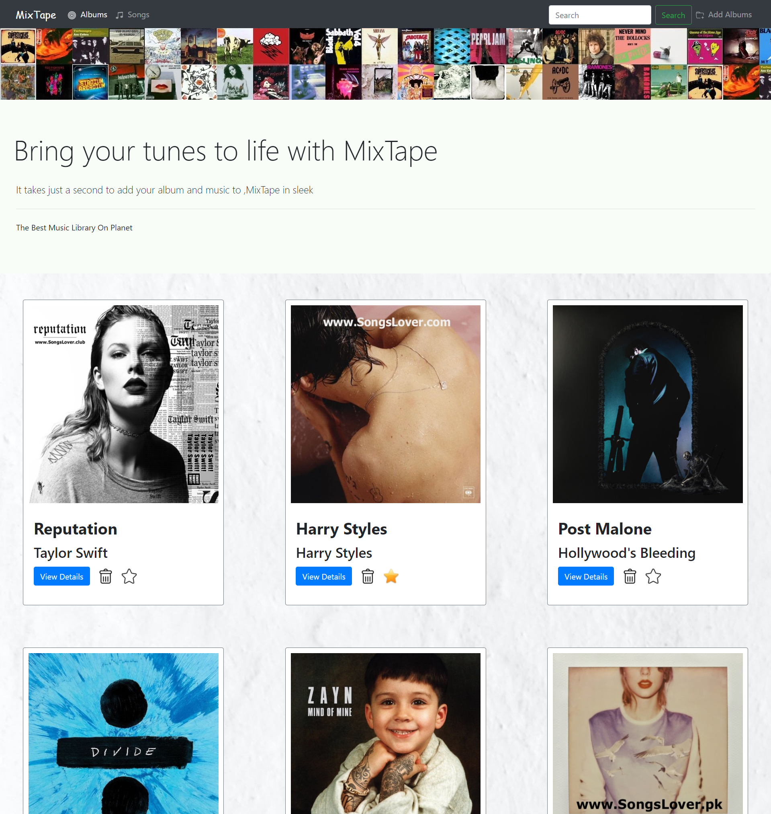
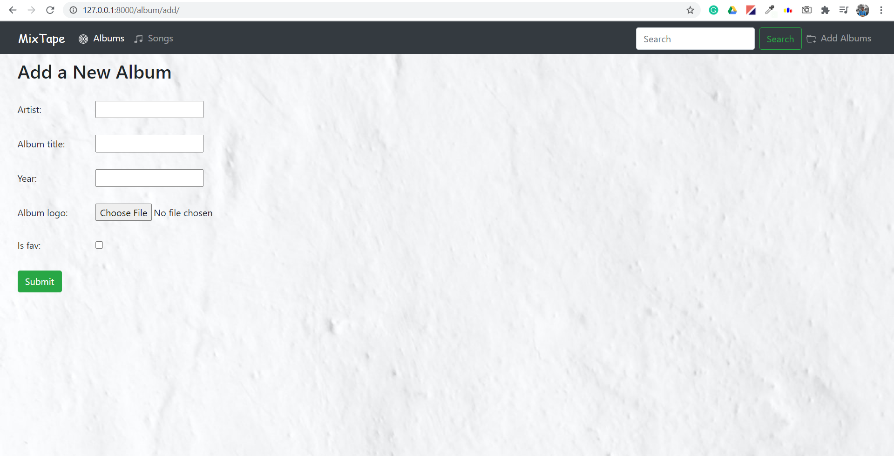
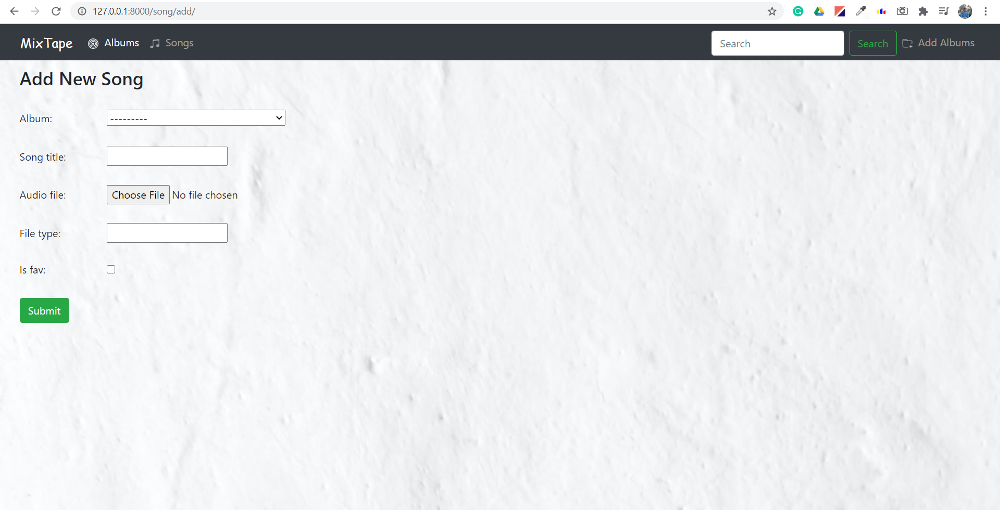
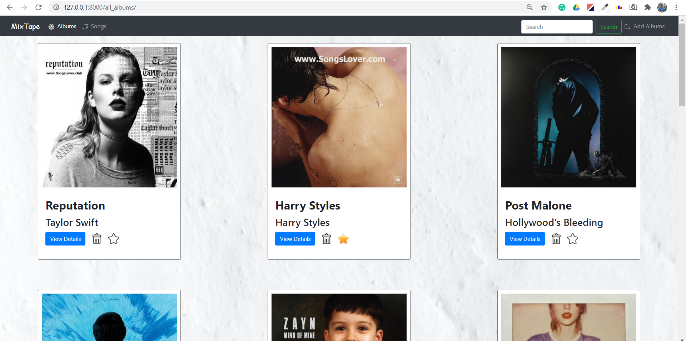

	 
	<h3>MixTape is an webapp where you can upload, store ,and play your music from cloud</h3>

	<h1>Homepage</h1>
	

	<h1>Adding Albums </h1>
	<h3>Start adding album to get started with the application by "Add Album" feature provided in the right-corner in navigation bar </h3>
	

	<h1>Adding Songs </h1>
	<h3>After creating an album ,go to detials of the album where "Add Songs" feature is available for adding songs to the respective album </h3>
	

	<h1>All Albums</h1>
	<h3>"Album" feature in the navigation bar lets you browse your all albums where you can favourite,delete ,and go to detail page of any particular album</h3> 
	

	<h1>All Songs</h1>
	<h3>Once any song has been added to an album, you can play,favourite and delete by using "Song" feature provided in the navigation bar</h3>
	

	<h1>Search </h1>
	<h3>Search for any music album or songs using the "Search" feature provided in top navigation bar</h3>
	

