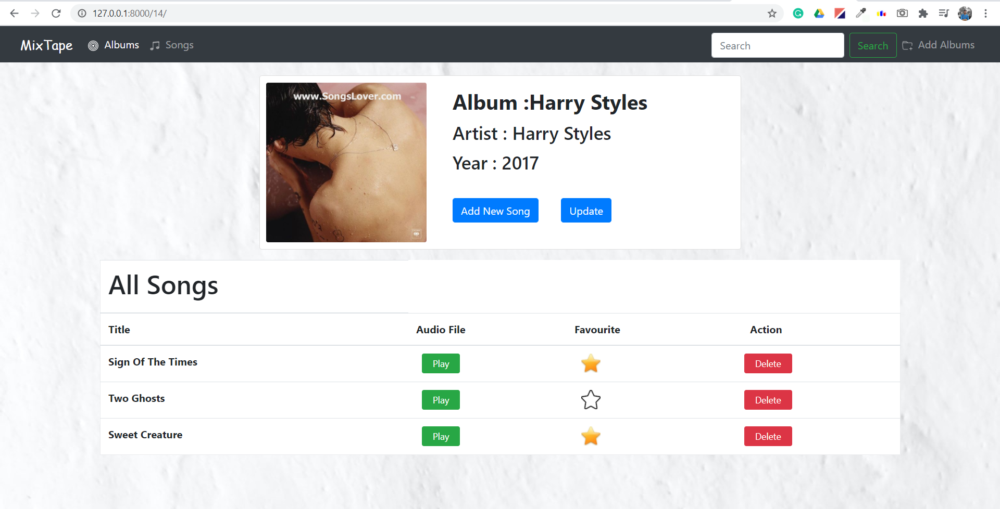
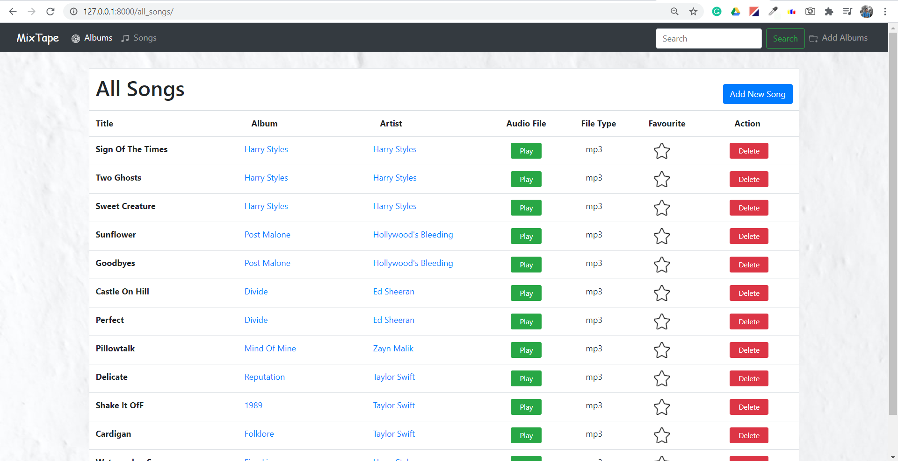
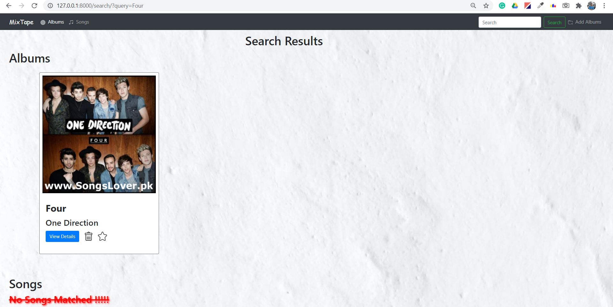
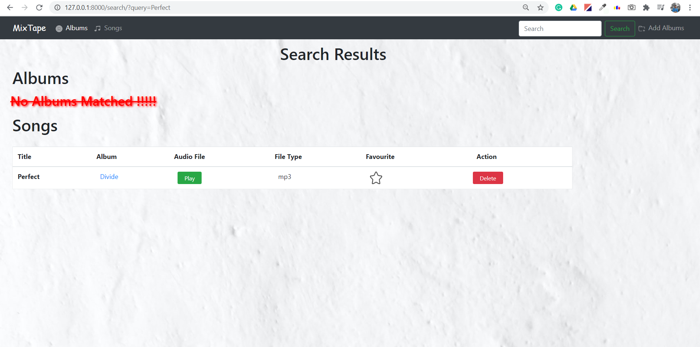

	 
	<h3>MixTape is an webapp where you can upload, store ,and play your music from cloud</h3>

	<h1>Homepage</h1>
	

	<h1>Adding Albums </h1>
	
Start adding album to get started with the application by "Add Album" feature provided in the right-corner in navigation bar 

	

	<h1>Detail View</h1>
	
You will be redirected to detail page after creating any album where you can get details about the album,"Update" details of your album ,and "Add New Songs".

	

	<h1>Adding Songs </h1>
	
After creating an album ,go to detials of the album where "Add Songs" feature is available for adding songs to the respective album 

	

	<h1>All Albums</h1>
	
"Album" feature in the navigation bar lets you browse your all albums where you can favourite,delete ,and go to detail page of any particular album
 
	

	<h1>All Songs</h1>
	
Once any song has been added to an album, you can play,favourite and delete by using "Song" feature provided in the navigation bar

	

	<h1>Search </h1>
	
Search for any music albums or songs using the "Search" feature provided in top navigation bar

	
	

